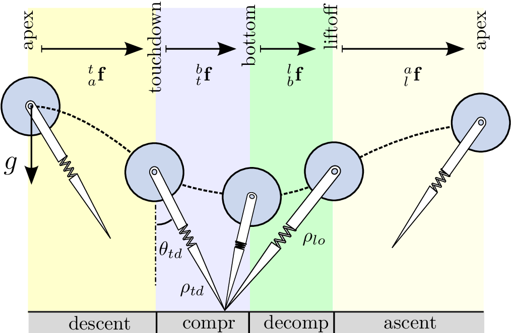

# SLIP Running Practice

This repo implements the Spring Loaded Inverted Pendulum (SLIP) dynamics simulation and running controller in MATLAB. The control input to the system is the touch down angle of its foot at the apex height in the flight phase. Methods include Raibert heuristic[1] foot placement and linearized deadbeat feedback[2] via precomputed gait library.

## Reference

[1] Raibert, M., Chepponis, M., & Brown, H. B. J. R. (1986). Running on four legs as though they were one. IEEE Journal on Robotics and Automation, 2(2), 70-82.

[2] Wensing, P. M., & Orin, D. E. (2013, November). High-speed humanoid running through control with a 3D-SLIP model. In 2013 IEEE/RSJ International Conference on Intelligent Robots and Systems (pp. 5134-5140). IEEE.

[3] Geyer, H., & Saranli, U. (2018). Gait based on the spring-loaded inverted pendulum. Humanoid Robotics: A Reference, 923-947.